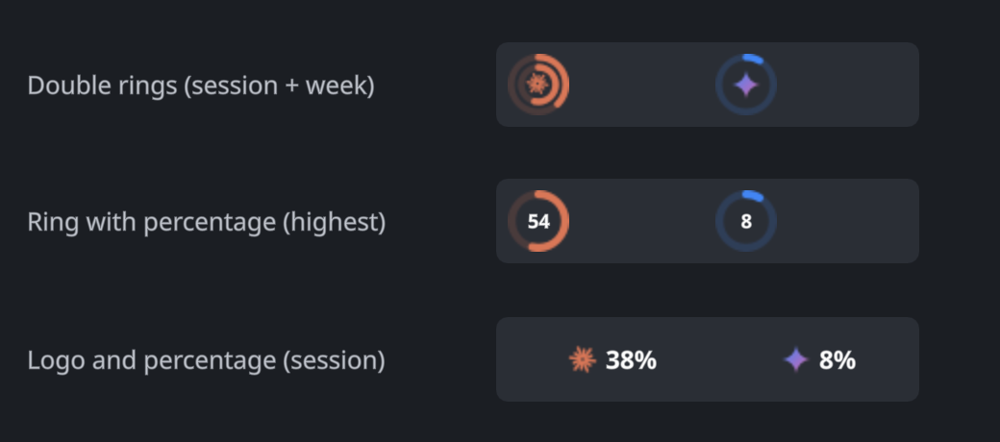
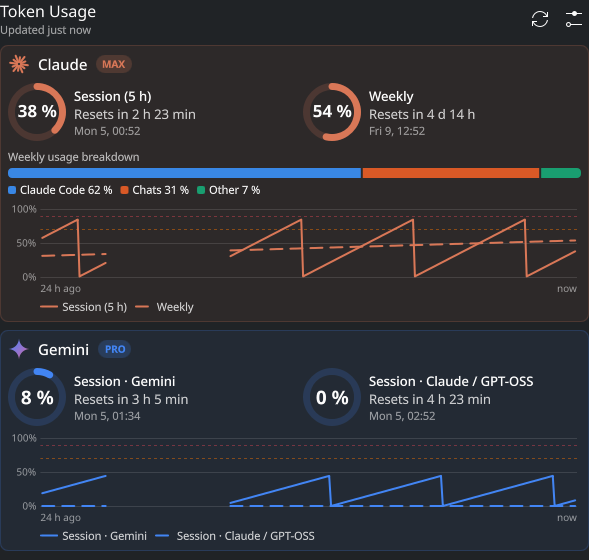
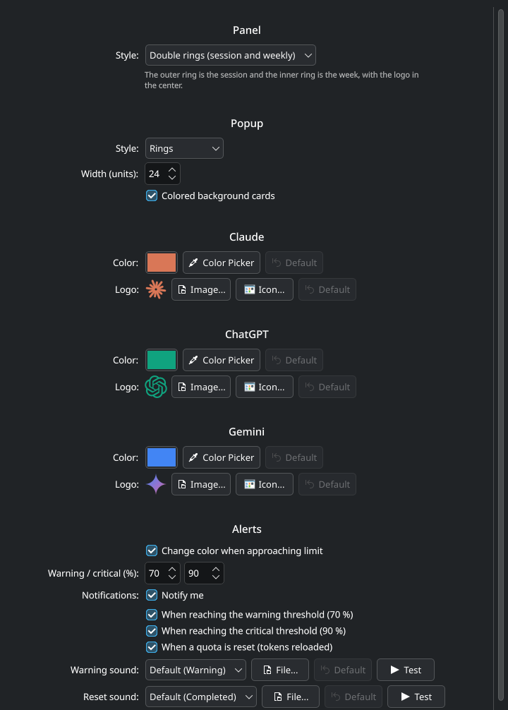

# Uso de tokens (Token Usage)

Un widget para Plasma 6 que monitoriza el uso de tus suscripciones de IA (Claude, ChatGPT y Gemini). Muestra el porcentaje de uso de tu sesión y semanal, una cuenta atrás hasta que se reinicien tus cuotas, gráficas del historial de uso y el reparto detallado del uso semanal de Claude.







## Características
- **Vista compacta del panel**: Elige entre anillos dobles, un anillo simple, o solo logo y porcentaje.
- **Ventana desplegable**: Tarjetas de color con todos los detalles de cada proveedor.
- **Alertas y notificaciones**: Recibe avisos al llegar a umbrales críticos o cuando tus cuotas se recarguen.
- **Historial de uso**: Gráficas de las últimas 6, 24, 72 o 168 horas.

## Requisitos
- **Plasma 6**
- `python3`
- `python-gobject` (para el cuentagotas)
- `pw-play` (PipeWire) o `paplay` (PulseAudio) para los sonidos.
- `ss` (iproute2) para Gemini.
- Por defecto usa el tema de sonido Ocean (`/usr/share/sounds/ocean/`). Si no lo tienes, puedes seleccionar otro sonido en la configuración.

## Proveedores
El widget usa las sesiones que ya tienes iniciadas en herramientas de la terminal. **Se basa en APIs no oficiales que podrían dejar de funcionar.**

| Proveedor | Fuente de datos | Notas |
|---|---|---|
| **Claude** | `~/.claude/.credentials.json` | Renueva el token automáticamente si caduca, **solo si Claude Code está cerrado**; si está abierto, espera a que lo renueve él. El token renovado se **guarda en `~/.claude/.credentials.json`** (el mismo archivo, con permisos `600`), porque el refresh token cambia en cada renovación y Claude Code necesita el válido. |
| **Gemini** | Servidor local de Antigravity | Antigravity debe estar abierto. Si está cerrado, muestra el último dato guardado. |
| **ChatGPT** | Codex CLI | *Experimental*. Lee `~/.codex/auth.json` y `~/.codex/sessions`. |

## Privacidad
- **Todo se queda en tu equipo**, salvo las consultas directas a los servidores de cada proveedor para leer el uso.
- El historial y los últimos datos se guardan localmente en `~/.local/share/aiusage/`.
- El único archivo fuera de sus propias carpetas en el que escribe el widget es `~/.claude/.credentials.json`, al renovar el token de Claude (ver arriba).
- No se envía telemetría ni datos a terceros.

## Instalación
**Opción A: Desde la KDE Store (Recomendada)**
Clic derecho en el panel o escritorio -> "Añadir widgets..." -> "Obtener nuevos widgets..." -> Busca "Token Usage".

La primera vez que se ejecuta, el widget registra sus notificaciones y su icono en `~/.local/share/`. Hasta entonces, "Añadir widgets" puede mostrar un icono genérico.

**Opción B: Instalación manual**
Clona este repositorio y ejecuta:
```bash
git clone https://github.com/natstyles/plasmoid-token-usage.git
cd plasmoid-token-usage
./install.sh
```

## Traducciones
El idioma base es inglés y tiene traducción completa al español. Para añadir otro idioma, usa la carpeta `translate/`.

## Marcas registradas
Claude, ChatGPT y Gemini son marcas registradas de Anthropic, OpenAI y Google respectivamente. Este proyecto no tiene afiliación con ellos. Los iconos por defecto son dibujos originales; puedes poner cualquier otra imagen desde la configuración.

## Licencia
[GPL-3.0-or-later](LICENSE)
